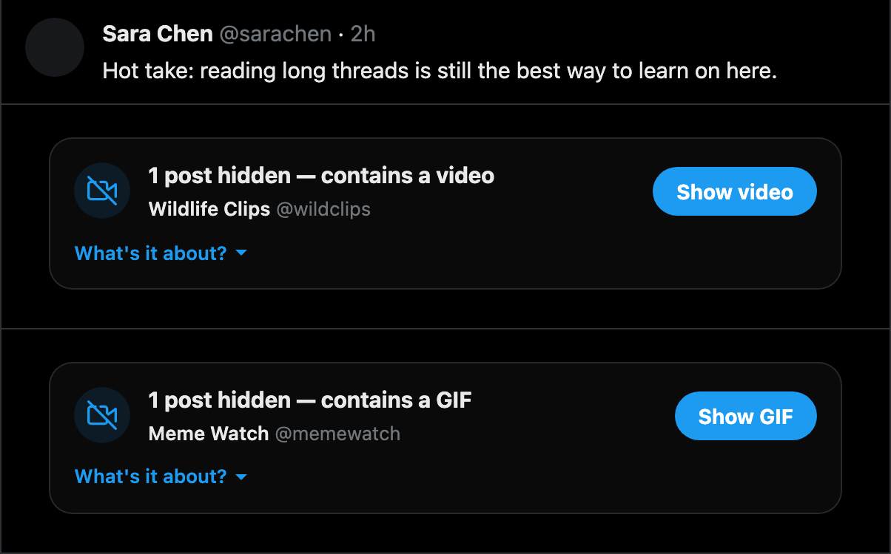
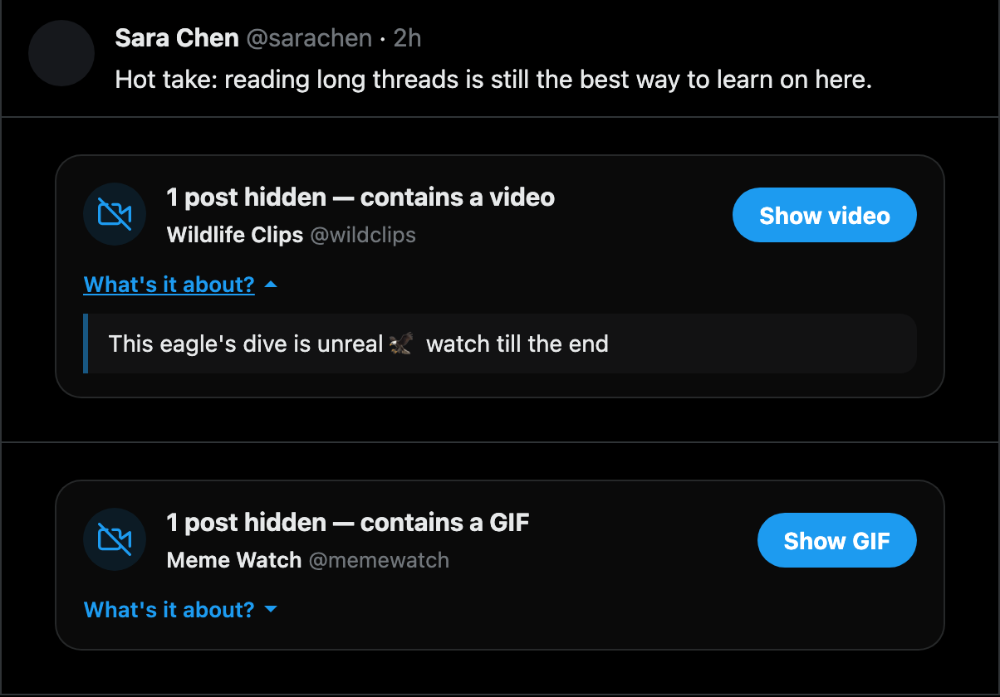
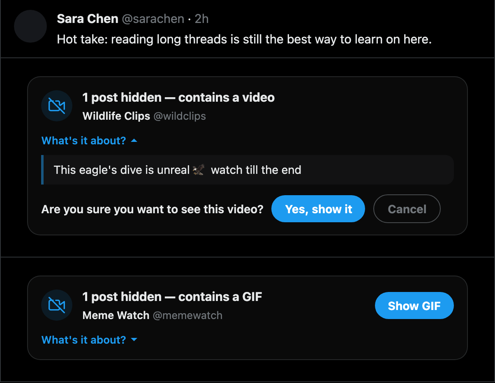
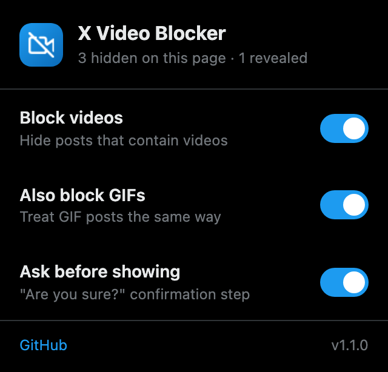

<p align="center">
  
</p>

<h1 align="center">X Video Blocker</h1>

<p align="center">
  <a href="LICENSE"></a>
  
  
</p>

<p align="center">
  Brave/Chrome extension that hides X/Twitter posts containing videos or GIFs —<br>
  so your timeline stops ambushing you with autoplay.
</p>

---

Each hidden post becomes a calm placeholder:

- **"1 post hidden — contains a video"** + author name and @handle
- **"What's it about?"** dropdown → shows the post text so you can decide without watching
- **"Show video"** → asks **"Are you sure?"** before revealing

<p align="center">
  
</p>

| "What's it about?" | "Are you sure?" |
|---|---|
|  |  |

## Settings popup

Click the toolbar icon to toggle behavior and see per-page stats:

<p align="center">
  
</p>

- **Block videos** — master switch
- **Also block GIFs** — exempt GIFs if you only mind real videos
- **Ask before showing** — skip the confirmation step if you trust yourself

Revealed posts stay revealed until you reload the page. Hiding uses `display: none`, which also stops autoplay — X only plays videos that are visible.

## Install in Brave

1. Open `brave://extensions`
2. Enable **Developer mode** (top right)
3. Click **Load unpacked** (or just drag this folder onto the page)
4. Select the `x-video-blocker` folder
5. Open or reload `x.com`

Same steps work in Chrome at `chrome://extensions`.

## How it works

- A content script watches the timeline with a `MutationObserver` and flags any `article[data-testid="tweet"]` containing a video player or GIF component
- Flagged posts get their content collapsed via CSS and a placeholder injected in place
- X's React re-renders and virtualized-list node recycling are handled: placeholders are rebuilt if React wipes them, and reveal state is keyed by tweet id (with a content fingerprint fallback) so recycled DOM nodes never leak state between posts
- Placeholder adapts to X's light/dim/dark themes automatically
- Settings sync via `chrome.storage.sync`; no background script, no network, no analytics

## Development & testing

```bash
bun install            # or npm install
bunx playwright install chromium

bun run test           # offline smoke test: full hide→dropdown→confirm→reveal flow
                       # against a replica of X's timeline DOM (18 checks, no login)
bun run test:live      # live test on x.com in a visible browser (log in once;
                       # session persists in test/.profile*, gitignored)
bun run icons          # regenerate extension icons
node test/gen-shots.mjs  # regenerate README screenshots
```

## Caveats

- Relies on X's `data-testid` attributes (`tweet`, `videoPlayer`, `videoComponent`, `tweetGif`, `tweetText`, ...). If X renames them, detection breaks — update the selectors at the top of `content.js`
- A post whose *quoted* tweet contains a video is hidden as a whole (intentional: the video would still autoplay otherwise)
- Audio/voice posts use a `<video>` element internally, so they're hidden too and labelled "video"

## License

[MIT](LICENSE)
